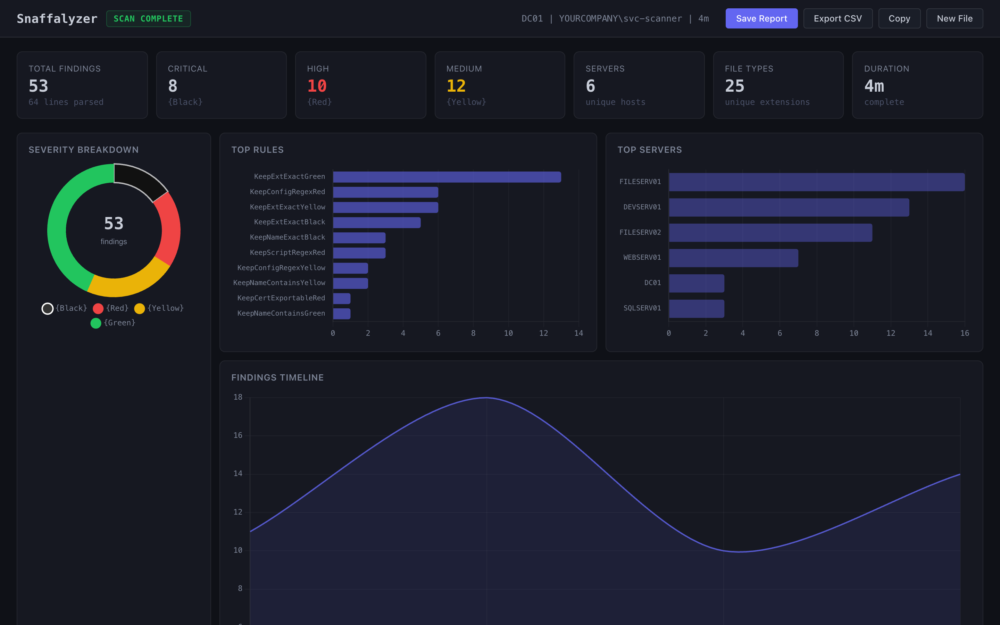
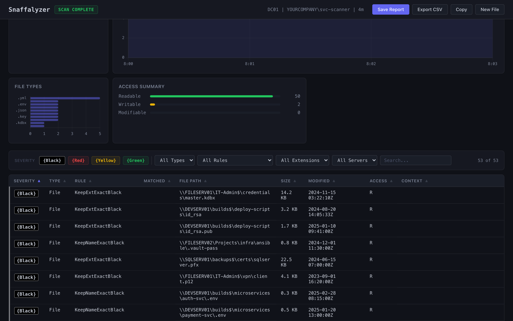

# Snaffalyzer

A parser and triage dashboard for [Snaffler](https://github.com/SnaffCon/Snaffler) security scan logs. Drag-and-drop a log file to get severity breakdowns, charts, filterable findings, and exportable reports. Everything runs offline and no data leaves your browser.

**Live:** [snaffalyzer.kabir.au](https://snaffalyzer.kabir.au)





## Features

- **Drag-and-drop** `.log`, `.txt`, and `.tsv` Snaffler output files
- **Auto-detect** plain and TSV log formats, complete vs incomplete scans
- **Dashboard** with severity donut chart, top rules, servers, file types, timeline, and access summary
- **Findings table** with sort, filter by severity/type/rule/extension/server, and full-text search
- **Export** to CSV, copy to clipboard
- **Save Report** as a self-contained HTML file (encrypted or unencrypted)
  - AES-256-GCM encryption with PBKDF2-SHA256 key derivation (600,000 rounds)
  - Report data stored as base64 in HTML data attributes with zero script injection
- **Fully offline** bundling all fonts, Chart.js, and assets into a single HTML file

## Quick start

```sh
bun install
bun run dev       # development server
bun run build     # production build → dist/
```

## Deploy

```sh
bun run build
bunx wrangler@latest pages deploy dist --project-name snaffalyzer
```

## Architecture

```
src/
  App.tsx              # State machine: drop → parse → dashboard
  components/
    DropZone.tsx        # File drag-and-drop UI
    Dashboard.tsx       # Header, metrics, charts, table, info log
    Charts.tsx          # Chart.js visualizations
    FindingsTable.tsx   # Sortable/filterable findings table
    SaveModal.tsx       # Save report with optional encryption
    ...
  utils/
    parser.ts           # Snaffler log parser (plain + TSV)
    crypto.ts           # AES-256-GCM encryption via Web Crypto API
    reportGenerator.ts  # Generates standalone HTML reports
    export.ts           # CSV export and clipboard copy
public/
  report-template.html  # Standalone vanilla HTML template for saved reports
```

Reports are generated by filling base64-encoded data into the template's `data-payload` attribute without raw HTML or script injection. The template includes its own parser, Chart.js, and rendering code independent of React.

## Severity levels

| Level | Meaning |
|-------|---------|
| `{Black}` | Critical — credentials, private keys, KeePass databases |
| `{Red}` | High — config files with passwords, connection strings |
| `{Yellow}` | Medium — interesting shares, scripts, backup files |
| `{Green}` | Low — default shares, readable directories |
